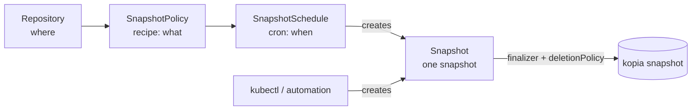

# Backups & schedules

Backing up is three resources, not one — and keeping them separate is the whole point. This page explains what each does, then walks the handful of fields you'll actually change.

/// tip | Recipe / invocation / schedule

- **`SnapshotPolicy`** = the **recipe**. _What_ to back up, how long to keep it, how to capture it. It is **idempotent and runs nothing on its own** — applying it just records intent.
- **`Snapshot`** = one **invocation**. A single kopia snapshot represented as a Kubernetes object. It is the **universal trigger**: a schedule creates one, or you `kubectl create` one, or Argo Events / Tekton / a Helm hook does.
- **`SnapshotSchedule`** = the **cron**. _When_ the recipe runs. It creates `Snapshot` CRs for you on a cadence.

Why split them? So you can re-run a recipe on demand without touching the schedule, pause a schedule without losing the recipe, and trigger backups from anything that can create a Kubernetes object — without three slightly-different copies of "what to back up".

///

All three are namespaced and live in the same namespace as the PVCs they back up (that's where the mover Job runs — see [Movers, RBAC & credentials](movers.md)).

## SnapshotPolicy — the recipe

A minimal recipe is a repository, a source, and a retention policy:

```yaml
apiVersion: kopiur.home-operations.com/v1alpha1
kind: SnapshotPolicy
metadata:
    name: postgres-data
    namespace: billing
spec:
    repository:
        name: primary # kind defaults to Repository (same namespace)
    sources:
        - pvc:
              name: postgres-data
    retention:
        keepDaily: 14
        keepWeekly: 4
```

### Sources — what to back up

`sources` is a list. Each entry is **exactly one of** a single PVC, a label selector, or an inline NFS export (mutually exclusive — the webhook rejects setting more than one on a source).

```yaml
sources:
    - pvc:
          name: postgres-data # one PVC by name
```

Or match many PVCs at once (see [example 04](examples.md#example-04--multi-pvc-selector)):

```yaml
sources:
    - pvcSelector:
          labelSelector:
              matchLabels: { backup: include }
      sourcePathStrategy: PvcName # or PvcNamespacedName to disambiguate same-named PVCs
```

Or back up an **NFS export directly** — no PVC (see [example 10](examples.md#example-10--nfs-source-no-pvc)):

```yaml
sources:
    - nfs:
          server: expanse.internal # NFS server hostname or IP
          path: /mnt/eros/Media # the export (an absolute path)
```

The operator mounts the export read-only into the backup mover and kopia snapshots it. By default kopia records the export `path` as the snapshot `sourcePath`; override it with `sourcePathOverride`. An NFS source works with **any** repository backend.

/// warning | Multi-PVC defaults to a consistent group

When a selector matches several PVCs, `groupBy` defaults to `VolumeGroupSnapshot` — one consistent point-in-time snapshot across all of them. You must set `groupBy: None` _explicitly_ to accept independent per-PVC snapshots; there is no silent fallback, because an inconsistent multi-volume backup is a data-integrity hazard.

///

### How the source is captured — `copyMethod`

| `copyMethod`           | What happens                                               | When                                                               |
| ---------------------- | ---------------------------------------------------------- | ------------------------------------------------------------------ |
| `Snapshot` _(default)_ | Point-in-time CSI `VolumeSnapshot`, then kopia reads that. | The safe default — consistent, no app downtime.                    |
| `Clone`                | CSI clone of the volume, mounted read-only.                | When your CSI driver prefers clones.                               |
| `Direct`               | Read the live PVC directly, no snapshot.                   | No point-in-time guarantee; only for quiesced or read-mostly data. |

`volumeSnapshotClassName` selects the snapshot class when `Snapshot`/`Clone` is used.

### Retention — how long backups are kept (GFS)

Retention is **grandfather-father-son** and is the **only** thing that prunes _successful_ backups. Kopiur enforces it by deleting `Snapshot` CRs outside the window (which, with the default `deletionPolicy`, deletes the underlying snapshots too).

```yaml
retention:
    keepLatest: 10 # keep the N most recent regardless of age
    keepHourly: 24
    keepDaily: 14
    keepWeekly: 8
    keepMonthly: 12
    keepAnnual: 3
```

Set only the buckets you care about; omit the rest. There is deliberately **no** `successfulJobsHistoryLimit` — successful retention is GFS, full stop. (Failed runs are bounded separately by `failedJobsHistoryLimit` on the `SnapshotSchedule`.)

### Identity — what kopia records (`username@hostname:path`)

kopia stores every snapshot under an identity. Kopiur resolves it **once at admission** and pins it to status; it is never re-rendered. The defaults:

- `username` ← the `SnapshotPolicy` name
- `hostname` ← the namespace
- `sourcePath` ← `/pvc/<pvcName>` for a PVC source, or the export `path` for an `nfs` source

Override either part when you need stable identities across renames or clusters:

```yaml
identity:
    username: postgres-data
    hostname: billing
```

(For a shared `ClusterRepository`, the repo can supply identity _CEL expressions_ so tenants get distinct identities automatically — see [Repositories → identityDefaults](repositories.md#identitydefaults--per-tenant-identity-cel). An explicit `identity` here always wins.)

### compression, files & extraArgs — kopia tuning and ignores

These map onto kopia's per-source policy and sit as **top-level** siblings of `retention` on the `SnapshotPolicy` spec:

```yaml
compression:
    compressor: zstd
    neverCompress: ["*.zip", "*.gz", "*.mp4"] # skip already-compressed files
files:
    ignoreRules: ["*.tmp", "*/cache/*", "lost+found"] # paths kopia skips
    ignoreCacheDirs: true # honor CACHEDIR.TAG
    ignoreIdenticalSnapshots: false # take a new snapshot even if nothing changed
extraArgs: [] # escape hatch for kopia flags not modeled above
```

| Field | What it does |
| --- | --- |
| `compression.compressor` | The kopia compressor (e.g. `zstd`, `gzip`, `s2`); omit to leave content uncompressed. |
| `compression.neverCompress` | Globs to never attempt to compress — already-compressed media, archives. |
| `files.ignoreRules` | `.gitignore`-style globs of paths to exclude from the snapshot. |
| `files.ignoreCacheDirs` | Honor `CACHEDIR.TAG` markers (skip directories tagged as caches). |
| `files.ignoreIdenticalSnapshots` | When `true`, kopia won't create a new snapshot if the source is byte-identical to the last one. |
| `extraArgs` | Pass-through kopia flags for anything not modeled above. |

The object **splitter** is not here — it is a repository property fixed at creation and lives on [`Repository.create.splitter`](repositories.md#encryption-and-repository-creation), where it applies repository-wide.

### errorHandling — let a snapshot complete with errors

The backup-side analog of restore's `ignorePermissionErrors` (ADR-0005 §13(b)). Each flag is off by default (kopia fails on the error); turn one on to let the snapshot finish anyway:

```yaml
errorHandling:
    ignoreFileErrors: true # --ignore-file-errors: skip unreadable files
    ignoreDirErrors: false # --ignore-dir-errors: skip unreadable directories
    ignoreUnknownTypes: true # --ignore-unknown-types: skip sockets/devices/...
```

### upload — parallelism

kopia's upload policy (ADR-0005 §13(f)); both knobs optional (absent leaves kopia's default):

```yaml
upload:
    maxParallelSnapshots: 4 # --max-parallel-snapshots: concurrent sources
    maxParallelFileReads: 8 # --max-parallel-file-reads: file-read concurrency
```

### verification — prove the snapshots are restorable

Opt-in (ADR-0005 §4). When absent, nothing runs. When set, the operator runs a frequent blob-level `kopia snapshot verify` (`quick`) and/or a rarer scratch-restore test (`deep`) on a cron, surfaces `status.lastVerified`, and (with `successExpr`) asserts the result is good:

```yaml
verification:
    quick: { cron: "0 4 * * *", jitter: 30m } # blob-level verify, often
    deep: # scratch-restore the latest snapshot into an ephemeral PVC, rarely
        schedule: { cron: "0 5 * * 0", jitter: 1h }
        capacity: 100Gi
        storageClassName: fast-ssd
    successExpr: "stats.files > 0 && stats.errors == 0" # CEL pass/fail predicate
    verifyFilesPercent: 10 # how much of each file `quick` reads fully
```

`successExpr` is a CEL predicate (returns `bool`) over the verify result — environment `stats{files,bytes,errors}`, `snapshot`, and (deep only) `restored{files,checksumMatches}`. It is validated at admission, so a typo is rejected on `kubectl apply`. See the [verification-drill scenario](scenarios/verification-drills.md).

### suspend — pause a recipe

`suspend: true` makes the operator skip this `SnapshotPolicy` entirely — no retention prune, no backups created by schedules, no verification — without deleting it. Surfaced in the `SUSPENDED` printer column. (`suspend` is now also available on `Repository`/`ClusterRepository`/`RepositoryReplication`, ADR-0005 §14(e).)

### hooks — quiesce the app around the snapshot

Hooks run **in the workload** (not the mover), before and after the snapshot — the classic use is flushing/locking a database so the snapshot is consistent. Three forms (exactly one per hook entry):

```yaml
hooks:
    beforeSnapshot:
        - workloadExec: # exec into a workload pod/container
              podSelector:
                  matchLabels: { app: postgres }
              container: postgres
              command: ["/bin/sh", "-c", "pg_backup_start"]
              timeout: 2m
    afterSnapshot:
        - workloadExec:
              podSelector:
                  matchLabels: { app: postgres }
              container: postgres
              command: ["/bin/sh", "-c", "pg_backup_stop"]
```

The other two forms are `runJob` (run a full one-shot `Job` owned by the `Snapshot` — the k8up `PreBackupPod` analog) and `httpRequest` (call a URL — default `POST`; `http://user:pass@…` becomes Basic auth). A worked manifest with all the knobs is [example 20](examples.md#example-20--quiesce-with-hooks).

Semantics you can rely on:

- A hook failure **aborts** the backup (`Failed` + a `HooksSucceeded=False` condition naming the hook and the cause) unless that hook sets `continueOnFailure: true`. An aborted backup never creates its mover Job; create a new `Snapshot` once the hook is fixed.
- `afterSnapshot` hooks run whether the backup succeeded **or failed** — the canonical pairing is quiesce/resume, and a failed backup must not leave your database quiesced.
- Each list runs **exactly once** per `Snapshot` (stamped on `status.hooks.preCompletedAt` / `postCompletedAt`), so requeues and controller restarts never repeat a side-effecting command.
- Each hook is bounded by its `timeout` (Go-style duration; default 5m) — a wedged quiesce fails the hook rather than hanging the backup forever.

### mover — resources, cache, security context

`spec.mover` tunes the **mover Job** that actually reads your data for this recipe — the pod that runs `kopia`. The exact same `mover` block is available on a `Restore` and a `Maintenance` ([Restores → mover](restores.md#mover-cache--failure-policy)). Every field is optional; omit the block entirely and you get an unprivileged mover (UID `65532`) with an `emptyDir` cache and no resource limits. The fields, and when to set each:

```yaml
mover:
    resources: # standard core/v1 ResourceRequirements for the mover container
        requests: { cpu: 250m, memory: 512Mi }
        limits: { cpu: "2", memory: 4Gi }
    securityContext: # standard core/v1 (CONTAINER) SecurityContext — UID/GID match
        runAsUser: 1000
        runAsGroup: 1000
        runAsNonRoot: true
        allowPrivilegeEscalation: false
        capabilities: { drop: ["ALL"] }
        seccompProfile: { type: RuntimeDefault }
    podSecurityContext: # standard core/v1 (POD) PodSecurityContext — notably fsGroup
        fsGroup: 1000 # make a fresh restore volume writable by an unprivileged mover
        fsGroupChangePolicy: OnRootMismatch
    # inheritSecurityContextFrom:   # ...OR copy the securityContext from a live pod
    #   podSelector: { matchLabels: { app: postgres } }
    #   container: postgres          # optional; defaults to the pod's first container
    cache: # kopia cache for this recipe (overrides the repository's moverDefaults.cache)
        capacity: 16Gi # size of the cache volume
        storageClassName: fast-ssd # cache volume's StorageClass (omit = cluster default)
        mode: Ephemeral # Ephemeral (default) | Persistent (warm cache across runs)
        contentCacheSizeMb: 10000 # kopia --content-cache-size-mb budget
        metadataCacheSizeMb: 2000 # kopia --metadata-cache-size-mb budget
    # privilegedMode: true           # opt-in, namespace-gated; preserve UID/GID on restore
```

| Value | What it does | When to change it |
| --- | --- | --- |
| `resources` | CPU/memory requests & limits on the mover container. | Large or many-file sources — give the mover memory headroom; or cap it so a backup doesn't starve the node. |
| `securityContext.runAsUser` / `runAsGroup` | The UID/GID the mover runs as. Default UID `65532` reads only world-readable or `65532`-owned files. | **Set it to the UID/GID that owns your data** so the mover can read it — the single most common knob (see [example 09](examples.md#example-09--mover-uidgid--permissions) and [Permissions](permissions.md)). |
| `podSecurityContext.fsGroup` | A **pod**-level `fsGroup` (and `fsGroupChangePolicy`). On mount the kubelet makes the volume group-writable by that GID. | Let an **unprivileged** mover populate a **freshly-provisioned restore volume** (root-owned `0755`) without a root mover. A pod-level `runAsUser: 0` here is still gated as privileged. See [Security context → fsGroup](security-context.md). |
| `inheritSecurityContextFrom` | Copy **both** the container `securityContext` **and** the pod-level `securityContext` (e.g. `fsGroup`) from a live workload pod (by label selector), instead of hard-coding them. **Mutually exclusive** with both `securityContext` and `podSecurityContext`. | When you'd rather "run exactly as the app runs" — same UID *and* fsGroup — than track them. Webhook-rejected if combined with either explicit context. See [Security context](security-context.md#2-inherit-it-from-the-workload) and [example 18](examples.md#example-18--inherit-the-mover-security-context-from-a-workload). |
| `cache.capacity` / `storageClassName` | Back the kopia cache with a sized volume instead of an `emptyDir`. | Large repositories — a sized cache avoids re-downloading metadata each run. |
| `cache.mode` | `Ephemeral` (fresh per run, GC'd with the Job) or `Persistent` (a controller-owned PVC reused across runs for a **warm** cache). | `Persistent` for big recurring backups where a warm cache speeds each run. It's `ReadWriteOnce`, so it assumes runs don't overlap. |
| `cache.contentCacheSizeMb` / `metadataCacheSizeMb` | kopia's content/metadata cache budgets (MiB). | Tune kopia's memory/disk cache footprint independently of the volume size. |
| `privilegedMode` | An opt-in elevation that also preserves original UID/GID ownership on **restore**. | Only when matching a single UID isn't enough (mixed ownership, `lost+found`). Namespace-gated — see below. |

A repository can set `moverDefaults.cache` that every mover inherits; `mover.cache` overlays them field-by-field (so you can, e.g., bump only `capacity` per recipe). See [Repositories → moverDefaults.cache](repositories.md).

/// warning | A privileged mover needs namespace opt-in

If the mover's **effective** securityContext runs as root (`runAsUser: 0`), sets `privileged: true`, allows escalation, adds capabilities, sets `runAsNonRoot: false`, or sets `privilegedMode: true` — **including a context inherited from a root workload pod** — the namespace must opt in with the `kopiur.home-operations.com/privileged-movers` annotation or the `Snapshot`/`Restore` is refused with a `MoverPermitted=False` condition. See [Movers → Privileged movers](movers.md#privileged-movers).

///

## Snapshot — one snapshot, the universal trigger

You usually let a `SnapshotSchedule` create `Snapshot` CRs. To run one **now** — first-time test, ad-hoc snapshot before a risky change, or from external automation — create one yourself (see [example 06](examples.md#example-06--manual-one-shot-backup)):

```yaml
apiVersion: kopiur.home-operations.com/v1alpha1
kind: Snapshot
metadata:
    generateName: postgres-data-manual- # API server appends a unique suffix
    namespace: billing
spec:
    policyRef:
        name: postgres-data # which recipe to run
    tags:
        reason: pre-upgrade # arbitrary kopia snapshot tags
```

Watch it move through its phases:

```console
$ kubectl get snapshots -n billing -w
NAME                       PHASE       ORIGIN   SNAPSHOT    AGE
postgres-data-manual-x9f   Pending     manual               2s
postgres-data-manual-x9f   Running     manual               7s
postgres-data-manual-x9f   Succeeded   manual   k1f1ec0a8   44s
```

`ORIGIN` tells you where a `Snapshot` came from: `scheduled` (a `SnapshotSchedule`), `manual` (you / automation), or `discovered` (materialized from snapshots Kopiur didn't create — see [Restores → discovered](restores.md#restoring-a-snapshot-kopiur-didnt-create)).

### `deletionPolicy` — what happens to the snapshot

A `Snapshot` CR **owns** its kopia snapshot via a finalizer. What happens to the snapshot when the CR is deleted is governed by `deletionPolicy`:

| Policy   | On `Snapshot` deletion                                                                                 | Default for                                                                |
| -------- | ---------------------------------------------------------------------------------------------------- | -------------------------------------------------------------------------- |
| `Delete` | Finalizer runs `kopia snapshot delete`, then removes the CR.                                         | `scheduled` / `manual` backups.                                            |
| `Retain` | CR is removed; the snapshot **stays** in the repository.                                             | `discovered` backups (forced — Kopiur won't delete what it didn't create). |
| `Orphan` | CR is removed **without contacting the repository** — escape hatch for "the bucket is already gone". | —                                                                          |

Set it per-`Snapshot` (`spec.deletionPolicy`) or set the recipe-wide default with `SnapshotPolicy.spec.defaultDeletionPolicy`. This is also how retention pruning reclaims space: pruned `Snapshot` CRs use `Delete`, so the snapshots go with them.

### `pin` — exempt a snapshot from retention

`Snapshot.spec.pin: true` pins the underlying kopia snapshot so GFS retention **never** expires it (ADR-0005 §13(c)) — for a pre-migration or compliance hold. The reconciler applies a `kopia snapshot pin`; clearing the field removes the pin. `pin` is independent of `deletionPolicy`: `pin` governs **retention expiry**, `deletionPolicy` governs what happens to the snapshot when **this CR** is deleted.

```yaml
spec:
    policyRef: { name: postgres-data }
    pin: true # GFS retention will skip this snapshot until you clear pin
```

### `failurePolicy` — retry & deadline for the mover Job

`Snapshot.spec.failurePolicy` controls the mover `Job`'s retry and wall-clock limits (the same surface a [`Restore`](restores.md#mover-cache--failure-policy) has):

```yaml
spec:
    policyRef: { name: postgres-data }
    failurePolicy:
        backoffLimit: 2 # retry the mover Job this many times before marking it failed (default 2)
        activeDeadlineSeconds: 3600 # kill a still-running backup after this many seconds (default: none)
```

| Value | What it does | When to change it |
| --- | --- | --- |
| `backoffLimit` | `Job.spec.backoffLimit` — retries before the run is marked failed. | Lower to fail fast on a flaky source; raise to ride out transient backend blips. |
| `activeDeadlineSeconds` | `Job.spec.activeDeadlineSeconds` — a hard wall-clock cap. | Set a ceiling so a wedged backup doesn't run forever; size it above your largest expected run. |

Failed `Snapshot` CRs from a schedule are bounded by `failedJobsHistoryLimit` (below); successful ones are pruned by GFS retention.

## SnapshotSchedule — the cron

A schedule binds a recipe to a cadence and creates `Snapshot` CRs (see [example 01](examples.md#example-01--single-pvc-scheduled)):

```yaml
apiVersion: kopiur.home-operations.com/v1alpha1
kind: SnapshotSchedule
metadata:
    name: postgres-data-nightly
    namespace: billing
spec:
    policyRef:
        name: postgres-data
    schedule:
        cron: "H 2 * * *" # see "H" below
        jitter: 30m
        timezone: America/Los_Angeles # IANA tz; omit for the controller default
        runOnCreate: false
        suspend: false
        concurrencyPolicy: Forbid
    failedJobsHistoryLimit: 3
```

### The fields you'll change

| Field                              | What it does                                                                                                                                 |
| ---------------------------------- | -------------------------------------------------------------------------------------------------------------------------------------------- |
| `schedule.cron`                    | When to fire. Supports Jenkins-style **`H`** (see below).                                                                                    |
| `schedule.jitter`                  | Spread firings over a window (e.g. `30m`), so many schedules don't all hit at once.                                                          |
| `schedule.timezone`                | IANA timezone the cron is evaluated in.                                                                                                      |
| `schedule.runOnCreate`             | `false` (default) means applying the schedule does **not** fire immediately — GitOps-friendly. Set `true` to backup the moment it's created. |
| `schedule.suspend`                 | `true` pauses future firings (in-flight and past runs are untouched).                                                                        |
| `schedule.concurrencyPolicy`       | What to do if a run is still in flight: `Forbid` (default, skip), `Allow` (run anyway), `Replace` (cancel the old one).                      |
| `schedule.startingDeadlineSeconds` | If a slot is missed by more than this (operator was down), skip it rather than fire late.                                                    |
| `failedJobsHistoryLimit`           | How many **failed** `Snapshot` CRs from this schedule to keep. Successful retention is GFS on the `SnapshotPolicy`.                              |

### `policyRef` or `policySelector` — one recipe or many

A schedule targets recipes one of two **mutually exclusive** ways (exactly one is required, webhook-enforced — ADR-0005 §10):

- `policyRef: { name: postgres-data }` — a single `SnapshotPolicy` (the common case, shown above).
- `policySelector` — a label selector over `SnapshotPolicy` objects in the schedule's namespace. Each matching policy gets a `Snapshot` per firing. "Back up everything tagged `tier=critical` nightly" becomes one object:

```yaml
spec:
    # mutually exclusive with policyRef
    policySelector:
        matchLabels: { tier: critical }
    schedule:
        cron: "H 2 * * *"
        jitter: 30m
```

/// tip | What `H` means

`H` is a Jenkins-style placeholder for "pick a stable value for me." `cron: "H 2 * * *"` doesn't mean minute 0 — it deterministically derives a fixed minute from this schedule's identity, so the schedule fires at, say, 02:17 every night. Combined with `jitter`, this spreads load across many schedules instead of stampeding the repository at exactly 02:00. The pinned next firing is in `status.nextSchedule.at`.

///

Inspect what the controller has computed:

```console
$ kubectl get snapshotschedule -n billing
NAME                    CONFIG          SCHEDULE    SUSPENDED   AGE
postgres-data-nightly   postgres-data   H 2 * * *   false       6d

$ kubectl get snapshotschedule postgres-data-nightly -n billing \
    -o jsonpath='{.status.nextSchedule.at}{"\n"}{.status.consecutiveFailures}{"\n"}'
```

## Putting it together



A `SnapshotPolicy` describes the work; a `SnapshotSchedule` (or you) turns it into `Snapshot` CRs; each `Snapshot` owns one snapshot for its lifetime. Retention prunes old `Snapshot` CRs, and (via `deletionPolicy: Delete`) their snapshots, keeping the repository in the GFS window.

## See also

- [Repositories & backends](repositories.md) — where snapshots are stored.
- [Restores](restores.md) — reading a snapshot back.
- [Movers, RBAC & credentials](movers.md) — where backups actually run and what they need.
- [Examples](examples.md) — [01 scheduled](examples.md#example-01--single-pvc-scheduled), [04 multi-PVC](examples.md#example-04--multi-pvc-selector), [06 manual](examples.md#example-06--manual-one-shot-backup).
