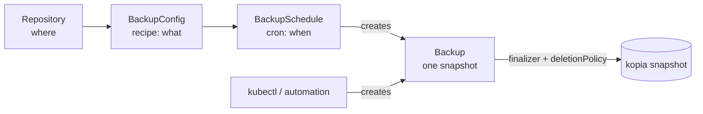

# Backups & schedules

Backing up is three resources, not one — and keeping them separate is the whole point. This page explains what each does, then walks the handful of fields you'll actually change.

/// tip | Recipe / invocation / schedule

- **`BackupConfig`** = the **recipe**. _What_ to back up, how long to keep it, how to capture it. It is **idempotent and runs nothing on its own** — applying it just records intent.
- **`Backup`** = one **invocation**. A single kopia snapshot represented as a Kubernetes object. It is the **universal trigger**: a schedule creates one, or you `kubectl create` one, or Argo Events / Tekton / a Helm hook does.
- **`BackupSchedule`** = the **cron**. _When_ the recipe runs. It creates `Backup` CRs for you on a cadence.

Why split them? So you can re-run a recipe on demand without touching the schedule, pause a schedule without losing the recipe, and trigger backups from anything that can create a Kubernetes object — without three slightly-different copies of "what to back up".

///

All three are namespaced and live in the same namespace as the PVCs they back up (that's where the mover Job runs — see [Movers, RBAC & credentials](movers.md)).

## BackupConfig — the recipe

A minimal recipe is a repository, a source, and a retention policy:

```yaml
apiVersion: kopiur.home-operations.com/v1alpha1
kind: BackupConfig
metadata:
    name: postgres-data
    namespace: billing
spec:
    repository:
        name: primary # kind defaults to Repository (same namespace)
    sources:
        - pvc:
              name: postgres-data
    retention:
        keepDaily: 14
        keepWeekly: 4
```

### Sources — what to back up

`sources` is a list. Each entry is **exactly one of** a single PVC, a label selector, or an inline NFS export (mutually exclusive — the webhook rejects setting more than one on a source).

```yaml
sources:
    - pvc:
          name: postgres-data # one PVC by name
```

Or match many PVCs at once (see [example 04](examples.md#example-04--multi-pvc-selector)):

```yaml
sources:
    - pvcSelector:
          labelSelector:
              matchLabels: { backup: include }
      sourcePathStrategy: PvcName # or PvcNamespacedName to disambiguate same-named PVCs
```

Or back up an **NFS export directly** — no PVC (see [example 10](examples.md#example-10--nfs-source-no-pvc)):

```yaml
sources:
    - nfs:
          server: expanse.internal # NFS server hostname or IP
          path: /mnt/eros/Media # the export (an absolute path)
```

The operator mounts the export read-only into the backup mover and kopia snapshots it. By default kopia records the export `path` as the snapshot `sourcePath`; override it with `sourcePathOverride`. An NFS source works with **any** repository backend.

/// warning | Multi-PVC defaults to a consistent group

When a selector matches several PVCs, `groupBy` defaults to `VolumeGroupSnapshot` — one consistent point-in-time snapshot across all of them. You must set `groupBy: None` _explicitly_ to accept independent per-PVC snapshots; there is no silent fallback, because an inconsistent multi-volume backup is a data-integrity hazard.

///

### How the source is captured — `copyMethod`

| `copyMethod`           | What happens                                               | When                                                               |
| ---------------------- | ---------------------------------------------------------- | ------------------------------------------------------------------ |
| `Snapshot` _(default)_ | Point-in-time CSI `VolumeSnapshot`, then kopia reads that. | The safe default — consistent, no app downtime.                    |
| `Clone`                | CSI clone of the volume, mounted read-only.                | When your CSI driver prefers clones.                               |
| `Direct`               | Read the live PVC directly, no snapshot.                   | No point-in-time guarantee; only for quiesced or read-mostly data. |

`volumeSnapshotClassName` selects the snapshot class when `Snapshot`/`Clone` is used.

### Retention — how long backups are kept (GFS)

Retention is **grandfather-father-son** and is the **only** thing that prunes _successful_ backups. Kopiur enforces it by deleting `Backup` CRs outside the window (which, with the default `deletionPolicy`, deletes the underlying snapshots too).

```yaml
retention:
    keepLatest: 10 # keep the N most recent regardless of age
    keepHourly: 24
    keepDaily: 14
    keepWeekly: 8
    keepMonthly: 12
    keepAnnual: 3
```

Set only the buckets you care about; omit the rest. There is deliberately **no** `successfulJobsHistoryLimit` — successful retention is GFS, full stop. (Failed runs are bounded separately by `failedJobsHistoryLimit` on the `BackupSchedule`.)

### Identity — what kopia records (`username@hostname:path`)

kopia stores every snapshot under an identity. Kopiur resolves it **once at admission** and pins it to status; it is never re-rendered. The defaults:

- `username` ← the `BackupConfig` name
- `hostname` ← the namespace
- `sourcePath` ← `/pvc/<pvcName>` for a PVC source, or the export `path` for an `nfs` source

Override either part when you need stable identities across renames or clusters:

```yaml
identity:
    username: postgres-data
    hostname: billing
```

(For a shared `ClusterRepository`, the repo can supply identity _templates_ so tenants get distinct identities automatically — see [Repositories → identityDefaults](repositories.md#identitydefaults--per-tenant-identity). An explicit `identity` here always wins.)

### policy — kopia tuning and ignores

```yaml
policy:
    compression:
        compressor: zstd
        neverCompress: ["*.zip", "*.gz", "*.mp4"] # skip already-compressed files
    ignore:
        paths: ["*.tmp", "*/cache/*", "lost+found"]
        cacheDirs: true # honor CACHEDIR.TAG
    extraArgs: [] # escape hatch for kopia flags not modeled above
```

### hooks — quiesce the app around the snapshot

Hooks run **in the workload** (not the mover), before and after the snapshot — the classic use is flushing/locking a database so the snapshot is consistent. Three forms (exactly one per hook entry):

```yaml
hooks:
    beforeSnapshot:
        - workloadExec: # exec into a workload pod/container
              podSelector:
                  matchLabels: { app: postgres }
              container: postgres
              command: ["/bin/sh", "-c", "pg_backup_start"]
              timeout: 2m
    afterSnapshot:
        - workloadExec:
              podSelector:
                  matchLabels: { app: postgres }
              container: postgres
              command: ["/bin/sh", "-c", "pg_backup_stop"]
```

The other two forms are `runJob` (run a full one-shot `Job` — the k8up `PreBackupPod` analog) and `httpRequest` (POST to a URL for cross-system orchestration). A hook failure **aborts** the backup unless you set `continueOnFailure: true`.

### mover — resources, cache, security context

`spec.mover` overrides the mover Job for this recipe: `resources`, `cache` (overrides the repository's `cacheDefaults`), and `securityContext`.

/// warning | A privileged mover needs namespace opt-in

If `mover.securityContext` runs as root (`runAsUser: 0`), sets `privileged: true`, allows escalation, adds capabilities, or sets `privilegedMode: true`, the namespace must opt in with an annotation or the `Backup` is refused. See [Movers → Privileged movers](movers.md#privileged-movers).

///

## Backup — one snapshot, the universal trigger

You usually let a `BackupSchedule` create `Backup` CRs. To run one **now** — first-time test, ad-hoc snapshot before a risky change, or from external automation — create one yourself (see [example 06](examples.md#example-06--manual-one-shot-backup)):

```yaml
apiVersion: kopiur.home-operations.com/v1alpha1
kind: Backup
metadata:
    generateName: postgres-data-manual- # API server appends a unique suffix
    namespace: billing
spec:
    configRef:
        name: postgres-data # which recipe to run
    tags:
        reason: pre-upgrade # arbitrary kopia snapshot tags
```

Watch it move through its phases:

```console
$ kubectl get backup -n billing -w
NAME                       PHASE       ORIGIN   SNAPSHOT    AGE
postgres-data-manual-x9f   Pending     manual               2s
postgres-data-manual-x9f   Running     manual               7s
postgres-data-manual-x9f   Succeeded   manual   k1f1ec0a8   44s
```

`ORIGIN` tells you where a `Backup` came from: `scheduled` (a `BackupSchedule`), `manual` (you / automation), or `discovered` (materialized from snapshots Kopiur didn't create — see [Restores → discovered](restores.md#restoring-a-snapshot-kopiur-didnt-create)).

### `deletionPolicy` — what happens to the snapshot

A `Backup` CR **owns** its kopia snapshot via a finalizer. What happens to the snapshot when the CR is deleted is governed by `deletionPolicy`:

| Policy   | On `Backup` deletion                                                                                 | Default for                                                                |
| -------- | ---------------------------------------------------------------------------------------------------- | -------------------------------------------------------------------------- |
| `Delete` | Finalizer runs `kopia snapshot delete`, then removes the CR.                                         | `scheduled` / `manual` backups.                                            |
| `Retain` | CR is removed; the snapshot **stays** in the repository.                                             | `discovered` backups (forced — Kopiur won't delete what it didn't create). |
| `Orphan` | CR is removed **without contacting the repository** — escape hatch for "the bucket is already gone". | —                                                                          |

Set it per-`Backup` (`spec.deletionPolicy`) or set the recipe-wide default with `BackupConfig.spec.defaultDeletionPolicy`. This is also how retention pruning reclaims space: pruned `Backup` CRs use `Delete`, so the snapshots go with them.

## BackupSchedule — the cron

A schedule binds a recipe to a cadence and creates `Backup` CRs (see [example 01](examples.md#example-01--single-pvc-scheduled)):

```yaml
apiVersion: kopiur.home-operations.com/v1alpha1
kind: BackupSchedule
metadata:
    name: postgres-data-nightly
    namespace: billing
spec:
    configRef:
        name: postgres-data
    schedule:
        cron: "H 2 * * *" # see "H" below
        jitter: 30m
        timezone: America/Los_Angeles # IANA tz; omit for the controller default
        runOnCreate: false
        suspend: false
        concurrencyPolicy: Forbid
    failedJobsHistoryLimit: 3
```

### The fields you'll change

| Field                              | What it does                                                                                                                                 |
| ---------------------------------- | -------------------------------------------------------------------------------------------------------------------------------------------- |
| `schedule.cron`                    | When to fire. Supports Jenkins-style **`H`** (see below).                                                                                    |
| `schedule.jitter`                  | Spread firings over a window (e.g. `30m`), so many schedules don't all hit at once.                                                          |
| `schedule.timezone`                | IANA timezone the cron is evaluated in.                                                                                                      |
| `schedule.runOnCreate`             | `false` (default) means applying the schedule does **not** fire immediately — GitOps-friendly. Set `true` to backup the moment it's created. |
| `schedule.suspend`                 | `true` pauses future firings (in-flight and past runs are untouched).                                                                        |
| `schedule.concurrencyPolicy`       | What to do if a run is still in flight: `Forbid` (default, skip), `Allow` (run anyway), `Replace` (cancel the old one).                      |
| `schedule.startingDeadlineSeconds` | If a slot is missed by more than this (operator was down), skip it rather than fire late.                                                    |
| `failedJobsHistoryLimit`           | How many **failed** `Backup` CRs from this schedule to keep. Successful retention is GFS on the `BackupConfig`.                              |

/// tip | What `H` means

`H` is a Jenkins-style placeholder for "pick a stable value for me." `cron: "H 2 * * *"` doesn't mean minute 0 — it deterministically derives a fixed minute from this schedule's identity, so the schedule fires at, say, 02:17 every night. Combined with `jitter`, this spreads load across many schedules instead of stampeding the repository at exactly 02:00. The pinned next firing is in `status.nextSchedule.at`.

///

Inspect what the controller has computed:

```console
$ kubectl get backupschedule -n billing
NAME                    CONFIG          SCHEDULE    SUSPENDED   AGE
postgres-data-nightly   postgres-data   H 2 * * *   false       6d

$ kubectl get backupschedule postgres-data-nightly -n billing \
    -o jsonpath='{.status.nextSchedule.at}{"\n"}{.status.consecutiveFailures}{"\n"}'
```

## Putting it together



A `BackupConfig` describes the work; a `BackupSchedule` (or you) turns it into `Backup` CRs; each `Backup` owns one snapshot for its lifetime. Retention prunes old `Backup` CRs, and (via `deletionPolicy: Delete`) their snapshots, keeping the repository in the GFS window.

## See also

- [Repositories & backends](repositories.md) — where snapshots are stored.
- [Restores](restores.md) — reading a snapshot back.
- [Movers, RBAC & credentials](movers.md) — where backups actually run and what they need.
- [Examples](examples.md) — [01 scheduled](examples.md#example-01--single-pvc-scheduled), [04 multi-PVC](examples.md#example-04--multi-pvc-selector), [06 manual](examples.md#example-06--manual-one-shot-backup).
