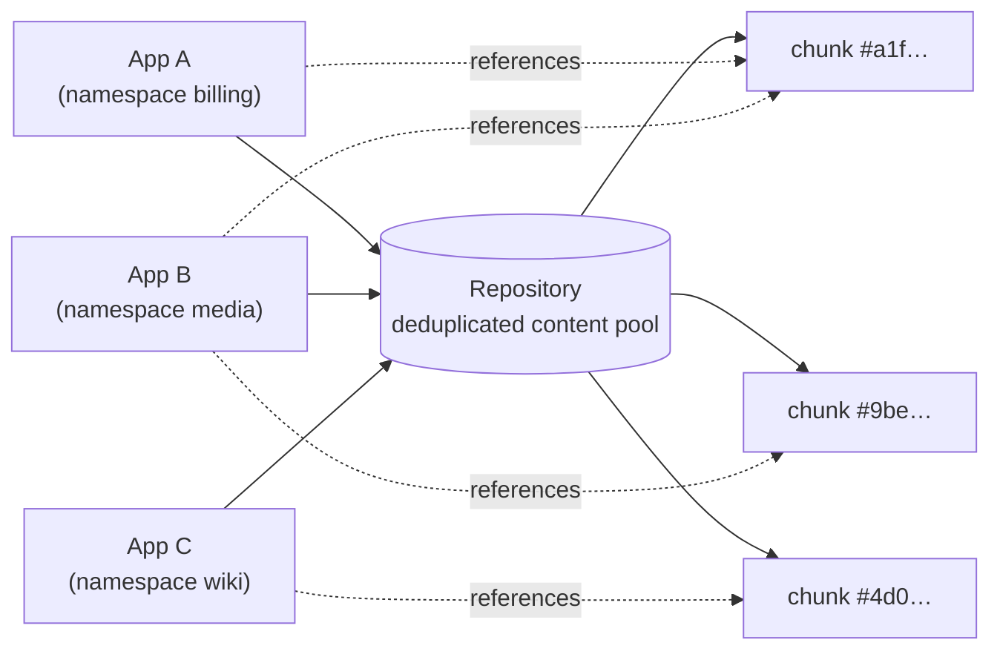

# How Kopia works

Kopiur is a thin Kubernetes operator wrapped around the [Kopia](https://kopia.io/docs/) backup engine — it drives the same `kopia` commands you could run by hand, just reconciled from CRDs. So almost everything Kopiur does follows from five Kopia ideas. Learn these and the rest of the docs read as obvious rather than arbitrary.

This page is the mental model. For the operator-specific resources built on top of it, see [Why Kopiur is designed this way](why-kopiur.md); for the hands-on first run, see [Getting started](../getting-started.md).

## The repository is a content-addressable store

A **repository** is the place your backups live — an S3 bucket, an Azure container, a NAS path, a B2 bucket, an SFTP server. But Kopia doesn't store files there as files. It splits every file into **content chunks**, hashes each chunk, and stores the chunk **once**, under its hash, as the key. Two chunks with identical bytes — anywhere, from any source, at any time — produce the same hash, so they are written exactly once and shared.

This is **content-addressable deduplication**, and it is the single most important thing to understand about Kopia. The repository is a deduplicated pool of content, not a pile of independent backups.



Three workloads in three namespaces, **one repository**: where their content overlaps (the same base image layer, the same shared library, similar database pages), it is stored once and referenced by all of them.

/// info | This is why one shared repository is the recommendation

Deduplication only works **within** a repository — two separate repositories can never share a chunk. That has a direct consequence for how you should lay Kopiur out, covered in [Recommended: one shared repository](#recommended-one-shared-repository) below.

///

## Snapshots are immutable, point-in-time manifests

A **snapshot** is a point-in-time record of one source. It is not a copy of the data — it is an immutable **manifest** that lists the content hashes making up that source at that instant. Taking a snapshot uploads only the chunks that are new; everything unchanged since last time already exists in the pool and is simply referenced again.

That is why a daily backup of a mostly-static volume is cheap: the second snapshot is almost entirely pointers to chunks the first one already uploaded. In Kopiur, **one `Backup` resource is one kopia snapshot** — see [Backups & schedules](../backups.md).

## Identity: `username@hostname:path`

Every snapshot is filed under a three-part **identity**: `username@hostname:path`. Kopia uses it to group a source's snapshot history and to keep different sources apart. The crucial property: **snapshots under different identities never collide**, even when they share one repository. Identity organizes the manifests; the content pool underneath is shared regardless.

This is the mechanism that makes a single shared repository safe for many independent workloads — each writes under its own identity, so nobody's snapshot history steps on anyone else's, while every writer still benefits from the shared, deduplicated content pool.

### How Kopiur fills it in

By default Kopiur derives the identity from the backup's namespace, config name, and source path, and lets you override any part with `BackupConfig.spec.identity`. On a shared [`ClusterRepository`](../repositories.md#clusterrepository-a-shared-repository), `identityDefaults` templates the identity per tenant namespace. The identity is **resolved once at admission and pinned to status**, so it never drifts if you re-apply the config:

```console
$ kubectl -n billing get backup postgres-data-20260607 \
    -o jsonpath='{.status.resolved.identity}'
billing-postgres-data@billing:/pvc/postgres-data
```

See [`identityDefaults` — per-tenant identity](../repositories.md#identitydefaults--per-tenant-identity) for the templating surface.

## Encryption

A repository is **encrypted at rest** with a password — `KOPIA_PASSWORD`. The content pool, the snapshot manifests, the indexes: all encrypted client-side before anything reaches the backend. A handful of parameters (the encryption algorithm, the chunk splitter, the hash) are chosen when the repository is first created and are **fixed forever** after that.

/// warning | Lose the password, lose the backups

`KOPIA_PASSWORD` is the only key. Kopia cannot decrypt a repository without it — there is no recovery, no reset, no support backdoor. Store it outside the cluster (a password manager or external secret store), and back up the Kubernetes Secret that holds it. See [Encryption and repository creation](../repositories.md#encryption-and-repository-creation).

///

## Maintenance and garbage collection

Deleting a snapshot does **not** immediately free space. It removes the snapshot's manifest, but the content chunks it referenced stay in the pool until they are proven unreferenced and reclaimed. That cleanup is a separate job — `kopia maintenance` — which Kopia runs in two passes: a lightweight **quick** maintenance (default every 6 hours) and a heavier **full** maintenance (default daily) that does the actual garbage collection.

So two things follow that surprise newcomers: expiring a backup doesn't shrink storage right away, and maintenance is **mandatory**, not optional — without it a repository grows unbounded. Kopiur runs it for you, default-managed per repository; you can tune or take it over. See [Maintenance](../maintenance.md).

## Recommended: one shared repository

Unless you have a specific reason not to, **point all of your backups at one repository.**

The reason is everything above: Kopia deduplicates by content hash across **every** writer in a repository. Pool all your workloads into one and the content they have in common — base image layers, shared libraries, similar database pages across namespaces — is stored exactly once. Split them into a repository each and you lose all of that: separate repositories cannot share a single chunk, so identical content is paid for over and over.

And it's safe to pool them, because of identity. Different `BackupConfig`s write under different `username@hostname:path` identities, so their snapshots never collide even though they share storage. One shared repository is therefore both the **safe** layout and the **maximally efficient** one — which is exactly why platform teams reach for a shared repository in the first place.

/// success | The recommended layout

- A **single namespace** that owns its backups → one [`Repository`](../repositories.md).
- A **platform team** serving many tenant namespaces → one [`ClusterRepository`](../repositories.md#clusterrepository-a-shared-repository), gated with `allowedNamespaces` and templated with `identityDefaults`. Use `prefix: ""` (the bucket root) so dedup spans every tenant.

A complete, apply-ready example is [Example 02 — Shared platform repository](../examples.md#example-02--shared-platform-repository), which shows two apps in two namespaces sharing one repository under distinct identities.

///

/// warning | Trade-offs of a shared repository

One repository is one basket. Weigh these before pooling everything:

- **Blast radius** — a shared repository is a single failure and corruption domain. A deleted bucket or a corrupted repository takes every workload's backups with it at once.
- **One password** — every writer shares one `KOPIA_PASSWORD`. The credential boundary is coarse: anyone who can read the repository can read **all** tenants' data, and rotating the password is an all-or-nothing operation.
- **Recovery if the repository is lost** — losing the one repository loses everything. Mitigate with backend-side versioning/replication (object-lock, bucket replication) and by keeping the password safe outside the cluster.

For most homelab and single-team setups, one repository is the right call. Split into separate repositories only when a workload genuinely needs its own failure domain or credential boundary — and accept that you forgo cross-workload dedup when you do.

///

## See also

- [Why Kopiur is designed this way](why-kopiur.md) — the resources Kopiur builds on top of these Kopia primitives.
- [Repositories & backends](../repositories.md) — configuring a `Repository`/`ClusterRepository` against each backend.
- [Maintenance](../maintenance.md) — how Kopiur schedules and coordinates `kopia maintenance`.
- [Kopia documentation](https://kopia.io/docs/) — the upstream engine, in depth.
- [ADR-0003](../adr/0003-kopiur-rust-operator.md) — the canonical design record.
