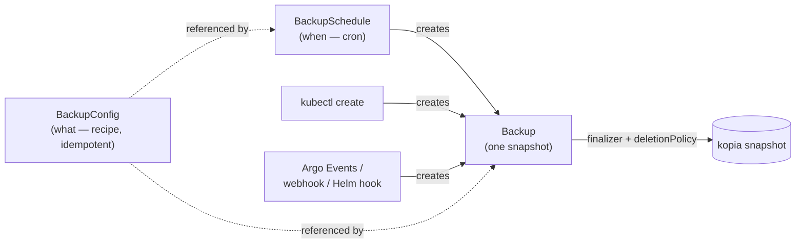

# Why Kopiur is designed this way

Kopiur makes a handful of deliberate choices that differ from other Kubernetes backup operators. This page explains the **why** behind the CRD surface, so the field-by-field references read as obvious. It assumes you've met the Kopia primitives in [How Kopia works](how-kopia-works.md). The canonical, exhaustive rationale is [ADR-0003](../adr/0003-kopiur-rust-operator.md); this is the readable version.

## Recipe, invocation, schedule — three resources, not one

The defining choice: Kopiur splits one backup job into **three** resources, each owning one question.

- **`BackupConfig` — the recipe (_what_).** PVC sources, identity, retention, hooks, policy. It is **idempotent and runs nothing on its own**. Editing it changes future backups; it never fires one.
- **`Backup` — the invocation (_that it happened_).** One kopia snapshot, as a Kubernetes object. It is the **universal trigger entry point**: a `Backup` can be created by a schedule, by `kubectl create`, by Argo Events, by a webhook, or by a Helm hook. The operator also _materializes_ `Backup`s for snapshots it discovers in the repository but didn't create.
- **`BackupSchedule` — the cron (_when_).** A cron expression plus jitter and timezone. It is **just one source** of `Backup` CRs — it creates them on a schedule, nothing more.

Because the three are separate, pausing or deleting a `BackupSchedule` doesn't disturb backups already running or already taken; tuning retention on a `BackupConfig` doesn't trigger a run; and any system that can `kubectl create` a `Backup` can trigger one. Operators that fold "what / when / trigger" into a single field (VolSync's `trigger`) make every one of those an awkward special case.

/// tip | Why separate them

The split buys three things you'd otherwise fight for: **edit the recipe without re-triggering**, **pause the schedule without affecting in-flight runs**, and **trigger a backup from anything** that can create a CR — GitOps, CI, an event bus, a `kubectl` one-liner.

///

## The repository is a first-class resource

A kopia repository is not configuration buried inside a source object — it is its own resource, [`Repository`](../repositories.md) (namespaced) or [`ClusterRepository`](../repositories.md#clusterrepository-a-shared-repository) (cluster-scoped). Lifecycle, credentials, encryption, maintenance, and tenancy gating all hang off it, and **many `BackupConfig`s point at one repository**, each writing under its own identity.

Making the repository first-class is what lets Kopiur recommend [one shared repository](how-kopia-works.md#recommended-one-shared-repository): the repo is defined and operated once, and consumers reference it by name without re-stating the backend or holding its root credentials.

## Type-safety end-to-end

This is the load-bearing reason Kopiur is written in Rust. Every "exactly one of" surface in the CRDs — which backend, which restore source, which deletion policy, which repository kind — is a Rust `enum`, and every reconciler `match`es it **exhaustively**. An invalid state (two backends at once, no backend at all) is literally unrepresentable, and a newly-added variant **cannot compile** until every handler accounts for it.

/// abstract | The load-bearing idea

Backup software has the highest "a silent wrong answer is catastrophic" coefficient of any controller class — a controller that quietly does nothing because a new case slipped past a `switch` can lose user data. Rust turns that whole class of bug into a compile error. Preserve this property in every change: prefer an `enum` + exhaustive `match` over a catch-all.

///

This is also why backends are **externally tagged** (`backend.s3`, not `backend.kind: S3`) — the shape itself enforces "exactly one backend." See [API conventions](../dev/api-conventions.md).

## A Backup CR owns its snapshot's lifecycle

A `Backup` CR **owns** its kopia snapshot through a finalizer. What happens to the snapshot when you delete the CR is governed by `deletionPolicy`:

- **`Delete`** (default for scheduled and manual backups) — deleting the CR runs `kopia snapshot delete`. This is also how retention reclaims space: pruned `Backup` CRs take their snapshots with them.
- **`Retain`** — the CR goes, the snapshot stays. **Forced** for _discovered_ backups, so the operator never deletes data it didn't create.
- **`Orphan`** — stop tracking the snapshot without deleting it.

/// warning | Deleting a Backup can delete its snapshot

With the default `deletionPolicy: Delete`, `kubectl delete backup` runs `kopia snapshot delete` via the finalizer — the backup is gone from the repository, not just from Kubernetes. Use `Retain` or `Orphan` to keep the snapshot. See [Backups → deletionPolicy](../backups.md#deletionpolicy--what-happens-to-the-snapshot).

///

Tying the snapshot's life to a Kubernetes object — instead of leaving snapshots floating in the repository, disconnected from the resource that made them — is what makes retention, deletion, and discovery legible from `kubectl`.

## Trade-offs we accepted

No design is free. Kopiur's choices come with costs we took on deliberately:

- **A larger blast radius for a deletion bug.** Because a `Backup` can delete its snapshot, a reconciler bug could delete data. Mitigated by attaching the finalizer only after status validates, forcing discovered backups to `Retain`, and the recoverability window that `kopia maintenance` provides before content is reclaimed.
- **A webhook in every write path.** Validation and identity resolution run at admission, so the admission webhook is on the critical path. It fails closed.
- **More to learn up front.** The `username@hostname:path` identity model is explicit rather than hidden — more concepts than "just back up this PVC," in exchange for predictable, collision-free shared repositories.
- **One extra concept (`ClusterRepository`).** The price of safe multi-tenant repository sharing.

## See also

- [How Kopia works](how-kopia-works.md) — the Kopia primitives these resources build on.
- [Backups & schedules](../backups.md) and [Repositories & backends](../repositories.md) — the field references.
- [API conventions](../dev/api-conventions.md) — the externally-tagged-enum rule and other type-safety conventions.
- [ADR-0003](../adr/0003-kopiur-rust-operator.md) — the canonical design record.
