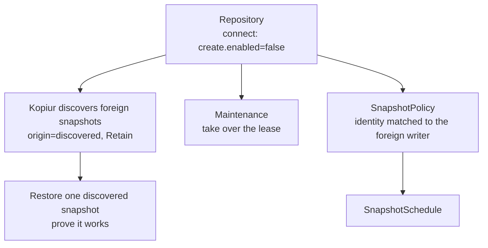

# Scenario 05 — Adopt an existing kopia repository

**You already have a kopia repo** — created by hand, by a cron job running the
kopia CLI, or by another tool — and you want Kopiur to take it over: see the old
snapshots, restore from them, run maintenance, and back up going forward
**without re-uploading data or stranding the existing snapshots**.

## What adoption does, step by step



/// info | Discovery is automatic — and Retain-forced

Once the `Repository` connects, Kopiur materializes snapshots it didn't create as
`Snapshot` CRs with `origin=discovered`, in the repository's namespace. Discovered
backups are **forced to `deletionPolicy: Retain`** — Kopiur never deletes data it
didn't create. List them:

```console
$ kubectl get snapshots -n adopt -l kopiur.home-operations.com/origin=discovered
```

///

The four deliberate moves in the bundle:

1. **Connect, don't create.** `create.enabled: false` — adopt the existing repo,
   never re-initialize it. The `KOPIA_PASSWORD` is the **existing** one.
2. **Take over maintenance.** A standalone `Maintenance` with an explicit
   `ownership` lease, so Kopiur and the old tooling don't both run
   `kopia maintenance`. We disable the `Repository`'s default-managed maintenance
   (`spec.maintenance.enabled: false`) so the takeover is deliberate, not
   automatic.
3. **Prove it.** Restore one discovered snapshot into a throwaway PVC.
4. **Back up going forward, matching identity.** Pin the new `SnapshotPolicy`'s
   `identity` to the foreign writer's `username@hostname:path` so new snapshots
   dedup against — and extend — the existing timeline.

/// warning | Taking the maintenance lease

`ownership.takeoverPolicy` is a closed enum: `Never` (default — refuses to touch
a lease another writer holds), `PromptCondition` (surfaces the conflict on
conditions and waits for you), or `Force` (seizes it immediately). The bundle uses
`PromptCondition`; switch to `Force` **only after** you've stopped the old
maintenance job, so two processes never compact the repo at once.

///

```yaml
--8<-- "deploy/examples/scenarios/05-adopt-existing-repo.yaml"
```

## Matching the foreign identity

This is the field most likely to trip you up. New backups only dedup against the
old data if Kopiur writes under the **same identity** the previous tool used.
Inspect a discovered `Snapshot`'s status (or `kopia snapshot list` against the repo)
to read the existing `username@hostname:path`, then set:

```yaml
identity:
    username: app-data # the existing snapshot's user
    hostname: legacy-host # the existing snapshot's host
```

If you _don't_ match it, backups still succeed — but they start a brand-new
lineage and re-upload a full copy instead of an incremental one.

## Verify adoption

```console
$ kubectl get repository legacy-primary -n adopt
NAME             PHASE   AGE
legacy-primary   Ready   25s

$ kubectl get maintenance legacy-primary-maintenance -n adopt
NAME                         REPOSITORY       OWNED   AGE
legacy-primary-maintenance   legacy-primary   true    25s

$ kubectl get restore adopt-smoke-test -n adopt
NAME               PHASE       AGE
adopt-smoke-test   Completed   45s
```

A `Ready` repo, an `OWNED` maintenance lease, and a `Completed` smoke-test restore
mean the repository is fully adopted.

## See also

- [Restores → discovered snapshots](../restores.md#restoring-a-snapshot-kopiur-didnt-create) and [example 07](../examples.md#example-07--restore-a-discovered-backup) — the two ways to restore foreign snapshots.
- [Maintenance](../maintenance.md) and [example 08](../examples.md#example-08--maintenance) — ownership leases and takeover policy in full.
- [Backups → identity](../backups.md#identity--what-kopia-records-usernamehostnamepath) — matching the foreign writer's identity.
