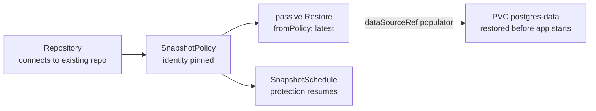

# Scenario 03 — Disaster recovery on a fresh cluster

**The cluster is gone.** A failed upgrade, a deleted namespace, a dead control
plane — but the repository in object storage survives. That's the entire point of
off-cluster backups. You stand up a new cluster, apply your GitOps repo, and the
app's data comes back as part of that apply, with **no "fresh install or
recovery?" branching**.

This is the headline [deploy-or-restore](../restores.md#deploy-or-restore-gitops)
pattern, hardened for DR with two changes from a normal install.

/// info | What makes this a DR bundle (vs. example 05)

1. The `Repository` **connects** to the existing repo (`create.enabled: false`)
   — it must already exist; we are not initializing a new empty one. A typo in
   the bucket then surfaces as a connect error instead of silently creating a
   second, empty repository at the wrong address.
2. A **passive `Restore`** (`source.fromPolicy`, no `target`,
   `onMissingSnapshot: Continue`) is wired into the PVC's `dataSourceRef` as a
   volume populator, so the PVC restores the latest snapshot **before the app
   starts**.

///

/// warning | Identity must match the old cluster

kopia finds the surviving snapshots by `username@hostname:path`. The defaults are
`username = SnapshotPolicy name` and `hostname = namespace`, so rebuilding with the
**same name in the same namespace** resolves the same snapshots automatically.
This bundle pins `identity` explicitly anyway, so recovery still works even if you
rebuild into a differently-named namespace. The `KOPIA_PASSWORD` must also be the
**original** one — kopia cannot decrypt the repo with a new password.

///

## The values you must get right

| Field | Must equal | Why |
| --- | --- | --- |
| `KOPIA_PASSWORD` | the **original** repo password | kopia can't decrypt otherwise. |
| `backend.s3.bucket` / `prefix` | the surviving bucket/prefix | that's where the snapshots are. |
| `create.enabled` | `false` | connect, don't re-initialize. |
| `identity.username` / `hostname` | what the old cluster recorded | so `fromPolicy` resolves the old snapshots. |

```yaml
--8<-- "deploy/examples/scenarios/03-disaster-recovery.yaml"
```

## What happens on apply



On a cluster pointed at the **existing** repo, the PVC is provisioned by restoring
the latest snapshot. On a genuinely **empty** repo, `onMissingSnapshot: Continue`
lets the PVC come up blank and be backed up going forward — the _same manifests_
either way.

## Verify the recovery

```console
$ kubectl get repository postgres-primary -n billing
NAME               PHASE   AGE
postgres-primary   Ready   20s

$ kubectl get pvc postgres-data -n billing
NAME            STATUS   VOLUME    CAPACITY   AGE
postgres-data   Bound    pvc-...   100Gi      35s

$ kubectl get restore postgres-data-restore -n billing
NAME                    PHASE       AGE
postgres-data-restore   Completed   40s
```

A `Bound` PVC and a `Completed` populator `Restore` mean the data is back; start
the app against it.

/// note | Kubernetes ≥ 1.24

The volume-populator handshake needs the `AnyVolumeDataSource` feature (GA from
1.24). The optional `volume-data-source-validator` surfaces a malformed
`dataSourceRef` as an event instead of a silently-stuck PVC.

///

## See also

- [Restores → deploy-or-restore](../restores.md#deploy-or-restore-gitops) and [example 05](../examples.md#example-05--deploy-or-restore-gitops) — the populator mechanism in detail.
- [Scenario 04 — migrate across clusters](migrate-across-clusters.md) — when the destination's name/namespace is _different_ (and `fromPolicy` won't resolve the old snapshots).
- [Repositories & backends](../repositories.md) — `create.enabled` and connection details.
