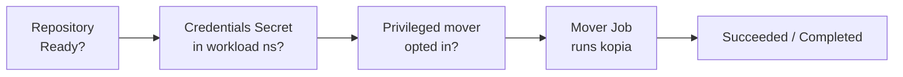

# Troubleshooting

Kopiur is built to **tell you why** something didn't happen rather than fail silently. Almost every problem surfaces in two places you can read without operator logs:

- **Conditions** on the resource — `kubectl describe <kind> <name> -n <ns>` (or `-o yaml`), and
- **Events** — also shown by `describe`, as `Warning`/`Normal` lines.

So the universal first move for any stuck resource is:

```console
$ kubectl describe repository <name> -n <ns>   # or snapshotpolicy / snapshot / restore / maintenance
```

Read the conditions and Events at the bottom. The messages are written to say **what** failed, **why**, and **how to fix it**.

This holds for **every** kopiur kind: any reconcile failure — a missing referenced Repository, an invalid spec, an unparseable cron, a backend rejection — is published as a `Warning` Event on the failing object with a machine-readable reason (`MissingDependency`, `InvalidSpec`, `InvalidSchedule`, or the kopia error class). Repeats of the same failure aggregate into one Event with a climbing count, so `kubectl get events -n <ns>` stays readable.

## A map of the pipeline

Most failures are one link in this chain not being green yet:



Work left to right: a `Snapshot`/`Restore` won't start until the `Repository` is `Ready`, the credential Secret is present, and (if elevated) the namespace has opted in.

## Repository never reaches `Ready`

```console
$ kubectl get repository -n <ns>
NAME      PHASE     BACKEND   AGE
primary   Failed    S3        2m
```

| Phase / symptom                | Likely cause                                                                               | Fix                                                                                                            |
| ------------------------------ | ------------------------------------------------------------------------------------------ | -------------------------------------------------------------------------------------------------------------- |
| `Failed`, connect error        | Wrong endpoint/region/bucket, or the bucket doesn't exist and `create.enabled` is `false`. | Fix the backend identifiers; set `create.enabled: true` for a genuinely new repo.                              |
| `Failed`, auth/"Access Denied" | Backend keys wrong or under the wrong Secret keys.                                         | Check the [credential key names](repositories.md#credential-secret-keys-by-backend) and the access key/secret. |
| `Failed`, decryption error     | `KOPIA_PASSWORD` doesn't match an existing repository.                                     | Use the original password — there is no recovery for a lost one.                                               |
| `Failed`, TLS error            | Self-signed or HTTP-only endpoint.                                                         | Set `backend.s3.tls.disableTls: true` (HTTP) or point `tls.caBundleRef` at the CA.                             |
| Stuck `Pending`                | Operator not running, or not watching this scope.                                          | Check the controller is up; for `ClusterRepository`, confirm `installScope=cluster`.                           |

```console
$ kubectl describe repository primary -n <ns>   # the condition message names the exact cause
```

## Backup (or Restore) stuck in `Pending` with no Job

The mover is blocked on a precondition. The two common ones, both surfaced as conditions and `Warning` Events:

### `CredentialsAvailable=False` — Secret missing in the workload namespace

The mover loads credentials with `envFrom`, which is **namespace-local**, so the credential Secret must exist in the namespace where the data (and the mover Job) live — not just where the repository is defined.

```console
$ kubectl get snapshots <name> -n <ns> \
    -o jsonpath='{.status.conditions[?(@.type=="CredentialsAvailable")].message}'
```

- For a namespaced `Repository`, the repo and Secret are already together — nothing extra.
- For a `ClusterRepository`, the credential Secret must reach each workload namespace. The easy fix: set [`credentialProjection.enabled: true`](movers.md#let-kopiur-project-the-credentials-secret-recommended-for-shared-repos) on the `SnapshotPolicy`/`Restore`/`Maintenance` that uses it, so Kopiur copies it for you (off by default). Otherwise replicate it yourself. See [Movers → the credentials Secret](movers.md#the-credentials-secret).

### `MoverPermitted=False` — privileged mover not opted in

The mover requests an elevated context but the namespace hasn't been granted it. This guards **`SnapshotPolicy`, `Restore`, and `Maintenance` alike** — and the *effective* (resolved) context is what's checked, so it also fires for an elevated context **inherited** from a workload pod. The detector trips on any of: `runAsUser: 0`, `privileged: true`, `allowPrivilegeEscalation: true`, added Linux capabilities, `runAsNonRoot: false`, or `privilegedMode: true` — at **either** the container (`mover.securityContext`) **or** pod (`mover.podSecurityContext`) level.

```console
# see the exact, actionable message (names the object + the annotation):
$ kubectl get restore <name> -n <ns> \
    -o jsonpath='{.status.conditions[?(@.type=="MoverPermitted")].message}'

# opt the namespace in (a cluster-admin decision):
$ kubectl annotate namespace <ns> kopiur.home-operations.com/privileged-movers=true
```

…or drop the elevated `securityContext` / `podSecurityContext` / `privilegedMode` from the `spec.mover`. It clears to `MoverPermitted=True` on the next reconcile (~30s). Full detail in [Movers → Privileged movers](movers.md#privileged-movers).

### `inheritSecurityContextFrom` can't resolve a workload pod

When `mover.inheritSecurityContextFrom` is set, the controller reads the live workload pod's container **and** pod security contexts onto the mover. If it can't, the Backup/Restore is held (a `MissingDependency`-style condition + Event) with a message naming exactly what's wrong:

| Message contains… | Cause | Fix |
| --- | --- | --- |
| `no pod matches` | The label selector matches no pod in the namespace (the workload is scaled to zero, or the labels are wrong). | Scale the workload up so its identity can be read, or fix `podSelector.matchLabels`. |
| `has no container` | `inheritSecurityContextFrom.container` names a container the pod doesn't have. | Fix the `container` name (omit it to take the pod's first container). |
| `sets no securityContext … to inherit` | The matched pod sets **neither** a container nor a pod-level `securityContext`. | Set one on the workload, or use an explicit `mover.securityContext` / `mover.podSecurityContext` instead. |

`securityContext` (or `podSecurityContext`) and `inheritSecurityContextFrom` are **mutually exclusive** — setting both is rejected at admission by the webhook.

## Backup runs but `Failed`

The mover Job ran and exhausted its retries (`failurePolicy.backoffLimit`). The error tail is on the `Snapshot`:

```console
$ kubectl get snapshots <name> -n <ns> -o jsonpath='{.status.logTail}'
# the structured failure block has the kopia error class + a retry hint:
$ kubectl get snapshots <name> -n <ns> -o jsonpath='{.status.failure.kopiaErrorClass}'
# full logs live in the mover Job's pod (the Job name is on the Snapshot):
$ JOB=$(kubectl get snapshot <name> -n <ns> -o jsonpath='{.status.job.name}')
$ kubectl logs -n <ns> --selector=job-name="$JOB"
```

`status.failure.retryRecommended: false` means retrying unchanged won't help —
fix the cause (`kopiaErrorClass` names it: `AuthFailure` = wrong password,
`PermissionDenied` = filesystem/bucket ACLs, …) and re-create the Snapshot. The
same `logTail`/`failure` fields appear on a failed `Restore`.

Common causes: the source PVC's `VolumeSnapshotClass` is wrong/missing (for `copyMethod: Snapshot`), a `beforeSnapshot` hook failed (it aborts the backup unless `continueOnFailure: true`), or the repository became unreachable mid-run.

## Mover pod stuck with `Multi-Attach error` (RWO PVC)

The mover **Job** exists but its **pod** never starts; `kubectl describe pod` shows:

```
Warning  FailedAttachVolume  ...  Multi-Attach error for volume "pvc-..."
                                   Volume is already exclusively attached to one node
```

A `ReadWriteOnce` (RWO) PVC can only be attached to one node at a time. The app pod holding it is on node A; the mover got scheduled to node B.

Kopiur avoids this **by default**: it pins an RWO source/destination mover to the node its PVC is attached to (`moverDefaults.sourceColocation.mode: Auto`). If you still hit this:

| Symptom | Likely cause | Fix |
| --- | --- | --- |
| Multi-Attach despite default `Auto` | `sourceColocation.mode: Disabled` is set, or co-location couldn't find the node (no running consumer pod; trimmed RBAC missing `persistentvolumes`/`volumeattachments` read). | Leave/restore `mode: Auto`; ensure the workload pod is running; grant the RBAC (see [Repositories → `sourceColocation`](repositories.md#sourcecolocation-avoid-the-rwo-multi-attach-error)). |
| Backup `Failed`: *"is ReadWriteOncePod and is currently held by a running pod"* | A `ReadWriteOncePod` volume can't be co-mounted by a second pod **at all** — even on the same node. | Use `copyMethod: Snapshot` (no downtime), scale the workload down for the backup window, or set `mode: Disabled` and manage placement yourself. See [PVC access modes & RWOP](access-modes.md). |
| Backup `Failed` (mode `Required`): *"could not determine which node it is attached to"* | `mode: Required` refuses to guess when no consumer pod / PV `nodeAffinity` / `VolumeAttachment` reveals the node. | Start the workload that uses the PVC, switch to `ReadWriteMany`, or relax to `mode: Auto`/`Disabled`. |

See [Repositories → `sourceColocation`](repositories.md#sourcecolocation-avoid-the-rwo-multi-attach-error) for the full behavior.

## Backup `Failed`: source staging (`copyMethod: Snapshot`/`Clone`)

`copyMethod: Snapshot` and `Clone` (opt-in; the default is `Direct`) capture a CSI snapshot/clone of the source PVC before backing it up. When that capture can't happen, the `Snapshot` is `Failed` with a `SourceStaged=False` condition naming exactly why — Kopiur never silently falls back to reading the live volume.

```console
$ kubectl get snapshot <name> -n <ns> -o jsonpath='{.status.conditions[?(@.type=="SourceStaged")]}'
```

| Reason | Cause | Fix |
| --- | --- | --- |
| `SnapshotStackMissing` | The cluster has no `VolumeSnapshotClass` API — the external-snapshotter (snapshot-controller + CRDs) isn't installed. | Install the [CSI snapshot stack](https://kubernetes-csi.github.io/docs/snapshot-controller.html) + a `VolumeSnapshotClass`, or set `copyMethod: Direct`. |
| `NoVolumeSnapshotClass` | No `VolumeSnapshotClass` matches the source PVC's driver, several match with no single default, or an explicit `volumeSnapshotClassName` doesn't exist. | Create/annotate a class for the driver, set `volumeSnapshotClassName` explicitly, or use `Direct`. |
| `VolumeSnapshotFailed` | The CSI driver reported an error creating the snapshot (the message includes the driver's text). | Fix the class/driver issue, then re-create the `Snapshot`. |
| `SourceNotCSIProvisioned` | The source PVC has no `StorageClass` (static/hostPath) — nothing to snapshot. | Use a CSI-provisioned PVC, or `copyMethod: Direct`. |

A staged backup that stays `Pending` with a `Pending` staged PVC (`<name>-src`) is usually a `WaitForFirstConsumer` class (normal — it binds when the mover starts) or, for `Clone`, a driver that can't clone the volume (`kubectl describe pvc <name>-src` shows the driver event). Staged objects are auto-cleaned when the backup finishes. Full guide: **[Copy methods](copy-methods.md)**.

## Restore won't complete

```console
$ kubectl describe restore <name> -n <ns>
```

| Symptom                                 | Cause                                                         | Fix                                                                                                                                                             |
| --------------------------------------- | ------------------------------------------------------------- | --------------------------------------------------------------------------------------------------------------------------------------------------------------- |
| `Failed`, "no matching snapshot"        | The source resolved to nothing and `onMissingSnapshot: Fail`. | Verify the `snapshotRef`/identity; for deploy-or-restore use `fromPolicy` (which defaults to `Continue`).                                                         |
| Stuck `Resolving`                       | Waiting for the source snapshot to appear (`waitTimeout`).    | Confirm the snapshot exists; raise `policy.waitTimeout` if a schedule is about to produce it.                                                                   |
| PVC stuck `Pending` (populator)         | Volume-populator handshake not completing.                    | Need Kubernetes ≥ 1.24; install `volume-data-source-validator` to see the real event. See [Restores → deploy-or-restore](restores.md#deploy-or-restore-gitops). |
| `identity` source rejected at admission | `source.identity` requires an explicit `spec.repository`.     | Add `spec.repository`.                                                                                                                                          |
| Stuck `Pending`, `MoverPermitted=False` | The restore mover requests an elevated context (root / `privilegedMode`, container- or pod-level, possibly inherited). | Annotate the namespace (above), or drop the elevation from `spec.mover`. |
| Restored files **owned by `65532`** / unreadable by the app | The mover wrote them as its own UID (no `mover.securityContext`). | Set `Restore.spec.mover.securityContext.runAsUser/Group` to the app's UID (or `inheritSecurityContextFrom`). |
| Mover pod `Pending`: **can't write the target volume** | A non-root mover can't write a freshly-provisioned PVC whose mount point is root-owned `0755`. | Add `Restore.spec.mover.podSecurityContext.fsGroup` (the app's GID) so the volume is group-writable; see [Restores → mover](restores.md#mover-cache--failure-policy). |
| Mover pod `Pending`: cache PVC **unbound** | `mover.cache.mode: Persistent` (or a sized `Ephemeral` cache) requested a `storageClassName` the cluster can't provision (or `ReadWriteOnce` contention with an overlapping run). | Use a valid `cache.storageClassName`, or drop `mover.cache` to fall back to an `emptyDir`. Persistent cache assumes non-overlapping runs per owner. |
| Mover `Failed`: `mkdir /var/cache/kopia/logs: permission denied` (any op, incl. maintenance) | The PVC-backed cache is owned `root:root` and the mover's default `fsGroup: 65532` couldn't chown it — almost always an **NFS** cache StorageClass with **root-squash** (e.g. TrueNAS / democratic-csi), where the kubelet's `fsGroup` chown is denied. | Don't put a kopia cache on NFS: drop `moverDefaults.cache` for a node-local `emptyDir` (always writable), or set `cache.storageClass` to a block class (e.g. Ceph RBD) that honors `fsGroup`. See [Security context → default](security-context.md#the-default-hardened-context). |

## Schedule isn't firing

```console
$ kubectl get snapshotschedule <name> -n <ns> \
    -o jsonpath='{.spec.schedule.suspend}{"  next="}{.status.nextSchedule.at}{"\n"}'
```

- `suspend: true` pauses all future firings.
- `runOnCreate: false` (the default) means applying the schedule does **not** fire immediately — wait for `status.nextSchedule.at`, or set `runOnCreate: true`.
- If the operator was down across a slot and `startingDeadlineSeconds` elapsed, that slot is skipped on purpose (no late stampede).
- Repeated failures show up as `status.consecutiveFailures`; the failing `Snapshot` CRs (bounded by `failedJobsHistoryLimit`) carry the reason.

## Maintenance isn't running

Maintenance waits for the repository and coordinates a single owner. Check the `Maintenance` resource:

```console
$ kubectl get maintenance -A
$ kubectl describe maintenance <name> -n <ns>
```

| `LeaseOwned=False` reason | Meaning                                                                                                                        |
| ------------------------- | ------------------------------------------------------------------------------------------------------------------------------ |
| `WaitingForRepository`    | The repository isn't `Ready` yet — fix that first.                                                                             |
| lease held elsewhere      | Another owner holds the maintenance lease (shared repo). Adjust `takeoverPolicy` only if you're sure no one else maintains it. |

`status.full.lastRunAt` shows the last full pass. See the [Maintenance guide](maintenance.md) for ownership and the schedule model.

## Webhook admission fails or the webhook won't start

The admission webhook validates `kopiur.home-operations.com` objects and serves
TLS. With the default `webhook.tls.mode: self`, the **controller** mints the
serving certificate into the `webhook.tls.secretName` Secret and injects the CA
into the two webhook configurations' `caBundle`. The most common symptoms:

| Symptom | Cause | Fix |
| ------- | ----- | --- |
| `kopiur-webhook` pod stuck `ContainerCreating` | The serving Secret doesn't exist yet — the controller mints it shortly after it becomes ready. | Wait a few seconds. If it persists, check the controller is `Ready` and its logs for `webhook TLS`; confirm `KOPIUR_NAMESPACE` is set (the chart sets it). |
| Creating any kopiur CR fails: `failed calling webhook ... no endpoints available` / `connection refused` | The webhook pod isn't `Ready` (e.g. still waiting on the Secret), and `failurePolicy: Fail`. | Wait for the webhook rollout; `kubectl -n kopiur-system rollout status deploy/<release>-webhook`. |
| Creating a CR fails: `x509: certificate signed by unknown authority` | The `caBundle` on the webhook config doesn't match the served cert. | In `self` mode the controller self-heals this within ~30s; check the controller logs for `webhook TLS reconcile failed`. Verify the operator has the `admissionregistration … patch` RBAC (`tls.mode: self` grants it). |
| `caBundle` empty on the webhook config | The controller couldn't patch it (RBAC, or the config didn't exist at boot). | Confirm `tls.mode: self` (so the chart grants the RBAC and sets the controller env); the controller retries injection every ~30s until it succeeds. |

Inspect the moving parts:

```console
# the serving Secret the controller mints (self mode):
$ kubectl -n kopiur-system get secret <webhook.tls.secretName> -o jsonpath='{.data.tls\.crt}' | head -c 20

# the caBundle the controller injected (should be non-empty in self mode):
$ kubectl get validatingwebhookconfiguration <release>-validating \
    -o jsonpath='{.webhooks[0].clientConfig.caBundle}' | head -c 20
```

Using cert-manager instead (`tls.mode: cert-manager`)? Then cert-manager issues
the cert and its ca-injector populates `caBundle` — check the `Certificate`
resource and the cert-manager logs, not the controller. See
[Installation → Webhook TLS](install.md#webhook-tls).

## Where to look — quick reference

```console
# conditions + events in one place (start here for anything):
$ kubectl describe <kind> <name> -n <ns>

# a Snapshot names its mover Job in status; a Restore's mover Job is named after the Restore.
$ kubectl get snapshot <name> -n <ns> -o jsonpath='{.status.job.name}'   # Snapshot only
$ kubectl get pods -n <ns> --selector=job-name=<job-name>                # job-name = above, or the Restore name
# or list every mover Job/pod for a policy at once:
$ kubectl get jobs,pods -n <ns> -l kopiur.home-operations.com/config=<policy-name>

# confirm the mover RBAC was minted in the workload namespace:
$ kubectl get serviceaccount,rolebinding -n <ns> -l app.kubernetes.io/component=mover

# operator logs (last resort) and health:
$ kubectl logs -n kopiur-system deploy/kopiur-controller
$ kubectl -n kopiur-system get deploy kopiur-controller kopiur-webhook
```

The controller and webhook also expose `kopiur_*` metrics on `/metrics` (and `/healthz`, `/readyz`). If you've enabled the chart's `ServiceMonitor`/`PrometheusRule`, the kopiur alerts fire on stuck phases and consecutive failures — see [Installation → Observability](install.md#observability) and [Observability](dev/observability.md).

## See also

- [Movers, RBAC & credentials](movers.md) — the credential + privilege preconditions in depth (with its own troubleshooting table).
- [Maintenance](maintenance.md) — maintenance ownership and scheduling.
- [Getting started](getting-started.md) — the happy-path walkthrough each step here mirrors.
