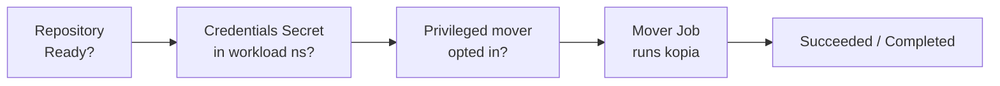

# Troubleshooting

Kopiur is built to **tell you why** something didn't happen rather than fail silently. Almost every problem surfaces in two places you can read without operator logs:

- **Conditions** on the resource — `kubectl describe <kind> <name> -n <ns>` (or `-o yaml`), and
- **Events** — also shown by `describe`, as `Warning`/`Normal` lines.

So the universal first move for any stuck resource is:

```console
$ kubectl describe repository <name> -n <ns>   # or backupconfig / backup / restore / maintenance
```

Read the conditions and Events at the bottom. The messages are written to say **what** failed, **why**, and **how to fix it**.

## A map of the pipeline

Most failures are one link in this chain not being green yet:



Work left to right: a `Backup`/`Restore` won't start until the `Repository` is `Ready`, the credential Secret is present, and (if elevated) the namespace has opted in.

## Repository never reaches `Ready`

```console
$ kubectl get repository -n <ns>
NAME      PHASE     BACKEND   AGE
primary   Failed    S3        2m
```

| Phase / symptom                | Likely cause                                                                               | Fix                                                                                                            |
| ------------------------------ | ------------------------------------------------------------------------------------------ | -------------------------------------------------------------------------------------------------------------- |
| `Failed`, connect error        | Wrong endpoint/region/bucket, or the bucket doesn't exist and `create.enabled` is `false`. | Fix the backend identifiers; set `create.enabled: true` for a genuinely new repo.                              |
| `Failed`, auth/"Access Denied" | Backend keys wrong or under the wrong Secret keys.                                         | Check the [credential key names](repositories.md#credential-secret-keys-by-backend) and the access key/secret. |
| `Failed`, decryption error     | `KOPIA_PASSWORD` doesn't match an existing repository.                                     | Use the original password — there is no recovery for a lost one.                                               |
| `Failed`, TLS error            | Self-signed or HTTP-only endpoint.                                                         | Set `backend.s3.tls.disableTls: true` (HTTP) or point `tls.caBundleRef` at the CA.                             |
| Stuck `Pending`                | Operator not running, or not watching this scope.                                          | Check the controller is up; for `ClusterRepository`, confirm `installScope=cluster`.                           |

```console
$ kubectl describe repository primary -n <ns>   # the condition message names the exact cause
```

## Backup (or Restore) stuck in `Pending` with no Job

The mover is blocked on a precondition. The two common ones, both surfaced as conditions and `Warning` Events:

### `CredentialsAvailable=False` — Secret missing in the workload namespace

The mover loads credentials with `envFrom`, which is **namespace-local**, so the credential Secret must exist in the namespace where the data (and the mover Job) live — not just where the repository is defined.

```console
$ kubectl get backup <name> -n <ns> \
    -o jsonpath='{.status.conditions[?(@.type=="CredentialsAvailable")].message}'
```

- For a namespaced `Repository`, the repo and Secret are already together — nothing extra.
- For a `ClusterRepository`, you must **replicate** the credential Secret into each workload namespace (Kopiur won't copy the shared repo's root credentials for you). See [Movers → the ClusterRepository gotcha](movers.md#the-credentials-secret-yours-to-place).

### `MoverPermitted=False` — privileged mover not opted in

The `BackupConfig` requests an elevated mover (root, `privileged`, escalation, added capabilities, or `privilegedMode`) but the namespace hasn't been granted it.

```console
$ kubectl annotate namespace <ns> kopiur.home-operations.com/privileged-movers=true
```

…or drop the elevated `securityContext` from the `BackupConfig`. Full detail in [Movers → Privileged movers](movers.md#privileged-movers).

## Backup runs but `Failed`

The mover Job ran and exhausted its retries (`failurePolicy.backoffLimit`). The error tail is on the `Backup`:

```console
$ kubectl get backup <name> -n <ns> -o jsonpath='{.status.logTail}'
# full logs live in the Job's pod:
$ kubectl logs -n <ns> -l kopiur.home-operations.com/backup=<name>
```

Common causes: the source PVC's `VolumeSnapshotClass` is wrong/missing (for `copyMethod: Snapshot`), a `beforeSnapshot` hook failed (it aborts the backup unless `continueOnFailure: true`), or the repository became unreachable mid-run.

## Restore won't complete

```console
$ kubectl describe restore <name> -n <ns>
```

| Symptom                                 | Cause                                                         | Fix                                                                                                                                                             |
| --------------------------------------- | ------------------------------------------------------------- | --------------------------------------------------------------------------------------------------------------------------------------------------------------- |
| `Failed`, "no matching snapshot"        | The source resolved to nothing and `onMissingSnapshot: Fail`. | Verify the `backupRef`/identity; for deploy-or-restore use `fromConfig` (which defaults to `Continue`).                                                         |
| Stuck `Resolving`                       | Waiting for the source snapshot to appear (`waitTimeout`).    | Confirm the snapshot exists; raise `policy.waitTimeout` if a schedule is about to produce it.                                                                   |
| PVC stuck `Pending` (populator)         | Volume-populator handshake not completing.                    | Need Kubernetes ≥ 1.24; install `volume-data-source-validator` to see the real event. See [Restores → deploy-or-restore](restores.md#deploy-or-restore-gitops). |
| `identity` source rejected at admission | `source.identity` requires an explicit `spec.repository`.     | Add `spec.repository`.                                                                                                                                          |

## Schedule isn't firing

```console
$ kubectl get backupschedule <name> -n <ns> \
    -o jsonpath='{.spec.schedule.suspend}{"  next="}{.status.nextSchedule.at}{"\n"}'
```

- `suspend: true` pauses all future firings.
- `runOnCreate: false` (the default) means applying the schedule does **not** fire immediately — wait for `status.nextSchedule.at`, or set `runOnCreate: true`.
- If the operator was down across a slot and `startingDeadlineSeconds` elapsed, that slot is skipped on purpose (no late stampede).
- Repeated failures show up as `status.consecutiveFailures`; the failing `Backup` CRs (bounded by `failedJobsHistoryLimit`) carry the reason.

## Maintenance isn't running

Maintenance waits for the repository and coordinates a single owner. Check the `Maintenance` resource:

```console
$ kubectl get maintenance -A
$ kubectl describe maintenance <name> -n <ns>
```

| `LeaseOwned=False` reason | Meaning                                                                                                                        |
| ------------------------- | ------------------------------------------------------------------------------------------------------------------------------ |
| `WaitingForRepository`    | The repository isn't `Ready` yet — fix that first.                                                                             |
| lease held elsewhere      | Another owner holds the maintenance lease (shared repo). Adjust `takeoverPolicy` only if you're sure no one else maintains it. |

`status.full.lastRunAt` shows the last full pass. See the [Maintenance guide](maintenance.md) for ownership and the schedule model.

## Webhook admission fails or the webhook won't start

The admission webhook validates `kopiur.home-operations.com` objects and serves
TLS. With the default `webhook.tls.mode: self`, the **controller** mints the
serving certificate into the `webhook.tls.secretName` Secret and injects the CA
into the two webhook configurations' `caBundle`. The most common symptoms:

| Symptom | Cause | Fix |
| ------- | ----- | --- |
| `kopiur-webhook` pod stuck `ContainerCreating` | The serving Secret doesn't exist yet — the controller mints it shortly after it becomes ready. | Wait a few seconds. If it persists, check the controller is `Ready` and its logs for `webhook TLS`; confirm `KOPIUR_NAMESPACE` is set (the chart sets it). |
| Creating any kopiur CR fails: `failed calling webhook ... no endpoints available` / `connection refused` | The webhook pod isn't `Ready` (e.g. still waiting on the Secret), and `failurePolicy: Fail`. | Wait for the webhook rollout; `kubectl -n kopiur-system rollout status deploy/<release>-webhook`. |
| Creating a CR fails: `x509: certificate signed by unknown authority` | The `caBundle` on the webhook config doesn't match the served cert. | In `self` mode the controller self-heals this within ~30s; check the controller logs for `webhook TLS reconcile failed`. Verify the operator has the `admissionregistration … patch` RBAC (`tls.mode: self` grants it). |
| `caBundle` empty on the webhook config | The controller couldn't patch it (RBAC, or the config didn't exist at boot). | Confirm `tls.mode: self` (so the chart grants the RBAC and sets the controller env); the controller retries injection every ~30s until it succeeds. |

Inspect the moving parts:

```console
# the serving Secret the controller mints (self mode):
$ kubectl -n kopiur-system get secret <webhook.tls.secretName> -o jsonpath='{.data.tls\.crt}' | head -c 20

# the caBundle the controller injected (should be non-empty in self mode):
$ kubectl get validatingwebhookconfiguration <release>-validating \
    -o jsonpath='{.webhooks[0].clientConfig.caBundle}' | head -c 20
```

Using cert-manager instead (`tls.mode: cert-manager`)? Then cert-manager issues
the cert and its ca-injector populates `caBundle` — check the `Certificate`
resource and the cert-manager logs, not the controller. See
[Installation → Webhook TLS](install.md#webhook-tls).

## Where to look — quick reference

```console
# conditions + events in one place (start here for anything):
$ kubectl describe <kind> <name> -n <ns>

# the mover Job + its pod for a backup/restore:
$ kubectl get jobs,pods -n <ns> -l kopiur.home-operations.com/backup=<name>
$ kubectl get jobs,pods -n <ns> -l kopiur.home-operations.com/restore=<name>

# confirm the mover RBAC was minted in the workload namespace:
$ kubectl get serviceaccount,rolebinding -n <ns> -l app.kubernetes.io/component=mover

# operator logs (last resort) and health:
$ kubectl logs -n kopiur-system deploy/kopiur-controller
$ kubectl -n kopiur-system get deploy kopiur-controller kopiur-webhook
```

The controller and webhook also expose `kopiur_*` metrics on `/metrics` (and `/healthz`, `/readyz`). If you've enabled the chart's `ServiceMonitor`/`PrometheusRule`, the kopiur alerts fire on stuck phases and consecutive failures — see [Installation → Observability](install.md#observability) and [Observability](dev/observability.md).

## See also

- [Movers, RBAC & credentials](movers.md) — the credential + privilege preconditions in depth (with its own troubleshooting table).
- [Maintenance](maintenance.md) — maintenance ownership and scheduling.
- [Getting started](getting-started.md) — the happy-path walkthrough each step here mirrors.
